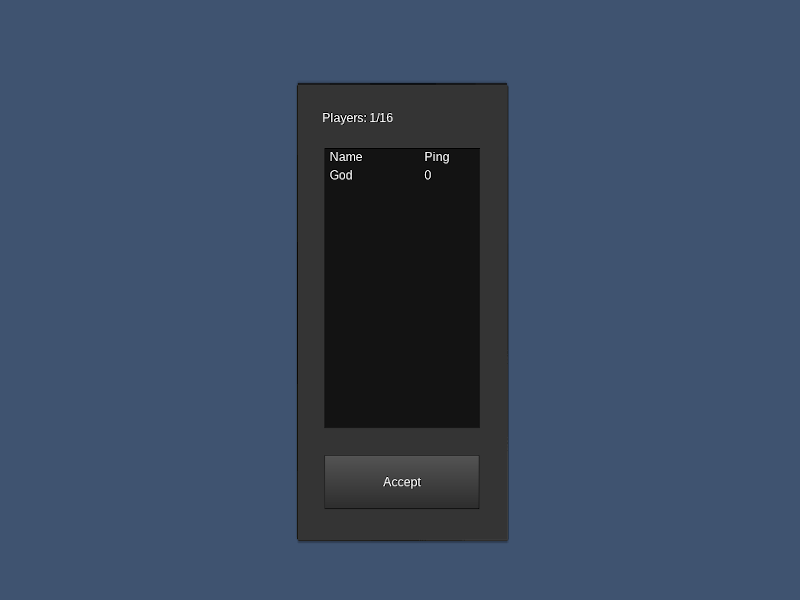

# player_list
A simple mod adding a menu to see all connected players and their ping. List automatically updates with specified interval.



## Requirements

- Minetest 5.0.0+
- Minetest_game 5.0.0+
- [sfinv_buttons](https://repo.or.cz/minetest_sfinv_buttons.git) (optional, but recommended. Adds a sfinv_button to display players)

## Usage
type `/playerlist` in chat to open the player list.  
Alternatively, if sfinv_buttons is installed, player list is available in inventory->more->Player List

## Settingtypes
Mod provides some settings, accessible via "Settings->All Settings->Mods->player_list  
You can also put these settings directly to your minetest.conf

```
player_list_update_interval = 2, int, update interval for formspec in seconds
```

## License
All code is GPLv3 [link to the license](https://www.gnu.org/licenses/gpl-3.0.en.html)  
playerlist_sfinv_icon.png (original name character.png), created by Jordach, CC BY-SA 3.0, extracted from minetest_game/mods/player_api.